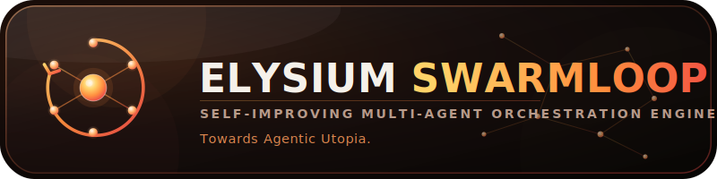

<p align="center">
  
</p>

<p align="center">
  <strong>The Self-Improving Multi-Agent Orchestration Engine</strong><br>
  <em>Towards Agentic Utopia.</em>
</p>

<p align="center">
  
  
  
  
</p>

> ⚠️ **Stato di verifica (v0.9.0):** CodeScoringEngine correctness: ceiling effect confermato (correctness=40.0 quando tests passano, 0.0 quando falliscono — vedi `risultati/correctness_falsification_test/`). DataScoringEngine fix verificato 5/5 coppie (vedi `risultati/dataengine_verification/`). Self-learning Δ non ancora ri-benchmarkato con 6+ loop.

## What is Elysium Swarmloop?

A Hermes Agent skill that transforms every prompt into an autonomous agentic workflow:

- **Massive parallelism** — up to 100 subagents per batch
- **Hierarchical orchestration** — depth-2: orchestrators spawn leaf workers
- **Streaming quality gate** — retry failures immediately, don't wait for batch completion
- **Self-learning** — captures patterns in SQLite, calibrates granularity, improves iteration after iteration *(mechanism implemented; efficacy not yet independently verified — see audit)*
- **Zero human intervention** — the loop keeps going until the goal is achieved
- **Tier-based execution** — Tier 1 (fast-path) to Tier 4 (full epic), auto-detected

## Repository Structure

```
├── SKILL.md                    # The autonomous loop engine (v0.7.0)
├── README.md                   # This file
├── SETUP.md                    # Complete installation guide
├── assets/
│   ├── logo-banner.svg         # Banner logo (800×200)
│   └── logo-icon.svg           # Icon logo (120×120)
├── scripts/
│   ├── init-state.sh           # Bootloader — initializes STATE
│   ├── install.sh              # Auto-installer (bash install.sh)
│   ├── e2e_test.py             # E2E test suite (35+ tests, 4 scenarios)
│   └── session_manager.py      # Session state tracking, checkpoint, recovery
└── references/
    ├── pattern-store.sql       # SQLite schema for pattern persistence
    └── user_preferences.yaml   # User preferences template for fine-tuning
```

## Core Loop

```
while goal_not_achieved:
    state = assess(goal, done, gaps)
    if state.is_done: break
    decide()         # what to do next based on state
    decompose()      # break remaining work into tasks
    scatter()        # dispatch all in parallel
    stream()         # process each result as it arrives
    learn()          # save patterns, calibrate, improve
```

## Quick Start

```bash
# Auto-install (raccomandato):
bash scripts/install.sh

# Oppure manuale:
skill_view(name='elysium-swarmloop')
```

## Required Config

```yaml
delegation:
  max_concurrent_children: 100   # up to 100 sub-agents in parallel
  max_async_children: 100        # same for async operations
  max_spawn_depth: 2             # orchestrators can spawn leaf workers
  child_timeout_seconds: 600     # enough time for complex tasks
  max_iterations: 50             # allow deep reasoning per agent
  orchestrator_enabled: true     # enable hierarchical orchestration
```

These settings are not optional tweaks. They are the difference between "it runs" and "it delivers production-quality results at scale."

- **v0.8.2** — Auditing release: documented invariant correctness scorer, hygiene fixes, cost transparency

### Phase 0.5a — Clarification Interview
Before the loop starts, the system asks 5–6 pre-flight questions to disambiguate goals, identify constraints, and surface hidden requirements. This prevents wasted iterations caused by ambiguous or underspecified goals.

### Phase 0.5b — Plan Integration
After clarification, a decomposition plan is written to file (`decomposition_plan.json`) before execution begins. This makes the plan explicit, auditable, and reusable across sessions.

### Phase 0.5c — Structural Alignment
The loop auto-detects project conventions — language, framework, test framework, file structure, linting rules — and aligns decomposition accordingly. No more generating Java-style decomposition for a Python project.

### Phase 3a-quinques — Parallel Sandbox Racing
For critical bugfixes, 3–5 variant implementations run in parallel against the same sandbox. The best-scoring variant is selected. This dramatically increases the chance of a correct first-pass fix.

### Quality-First Mode Override
On-demand override to raise the quality threshold to 9/10. When activated, every subagent output must score 9+ before acceptance — no exceptions. Use this for production-critical or client-facing deliverables.

### Hard Trigger Activation
Bypass the 4-Band Filter with specific keywords. When the goal contains designated trigger terms (e.g., "full epic", "enterprise", "swarmloop"), the loop goes directly to full autonomous mode without filter pre-check.

### User Preferences Template
A YAML-configurable template (`references/user_preferences.yaml`) that lets users fine-tune behavior: preferred threshold, max retries, sandbox racing on/off, hard triggers, and output verbosity.

### Config Prerequisites Section in SKILL.md
A dedicated prerequisites section documents every config parameter the skill needs, with exact values and rationale. No more guessing why the loop behaves differently than expected.

### Global Re-Check Pass
A post-assembly integrity scan that checks all outputs for cross-file consistency, interface compatibility, missing imports, and silent quality degradation after the assembly task. Runs once after all subagent output is integrated.

### E2E Test Script
`scripts/e2e_test.py` — a comprehensive test suite with 35+ automated tests across 4 scenarios:
- **Scenario 1:** Tier auto-detection accuracy
- **Scenario 2:** Streaming quality gate behaviour
- **Scenario 3:** Self-learning pattern capture
- **Scenario 4:** Full loop convergence with parallel sandbox racing

Run with:
```bash
python scripts/e2e_test.py
```

### Enhanced Session Manager
`scripts/session_manager.py` — extended with:
- **Checkpointing:** automatic state snapshots every 8 turns or 10 minutes
- **Interrupt Recovery:** resume from the exact point of interruption with full context
- **Quality Trend Monitoring:** detect degradation in the last 5 evaluations and alert before quality spirals

## License

MIT

## Authors

- **Boschi404** — Creator and Lead Architect
- **ffazecaldy** — Collaborator and Co-Architect
- **Hermes Agent** — Testing Agent

---

<p align="center">
  
</p>
