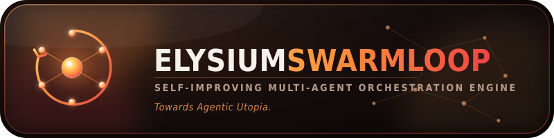

<p align="center">
  
</p>

<p align="center">
  <strong>The Self-Improving Multi-Agent Orchestration Engine</strong><br>
  <em>Towards Agentic Utopia.</em>
</p>

<p align="center">
  
  
  
  
</p>

> ⚠️ **Stato di verifica (v0.14.0):** Swarmloop Mode (Phase 0.7) introdotto — loop gauntlet-style con bar esterna, critici indipendenti a contesto fresco e pre-flight cost gate. Trigger modalità ridefiniti con keyword case-sensitive: `MAX EFFORT`, `SWARMLOOP MODE`, `MESM`. E2E: 224/224 check passati. Self-learning resta "non verificato" — vedi `risultati/AUDIT_SCORING_ENGINE.md`.

## What is Elysium Swarmloop?

A Hermes Agent skill that transforms every prompt into an autonomous agentic workflow:

- **Massive parallelism** — up to 100 subagents per batch
- **Hierarchical orchestration** — depth-2: orchestrators spawn leaf workers
- **Streaming quality gate** — retry failures immediately, don't wait for batch completion
- **Self-learning** — captures patterns in SQLite, calibrates granularity, improves iteration after iteration *(mechanism implemented; efficacy not yet independently verified — see audit)*
- **Zero human intervention** — the loop keeps going until the goal is achieved
- **Tier-based execution** — Tier 1 (fast-path) to Tier 4 (full epic), auto-detected
- **Swarmloop Mode** — gauntlet-style builder/critic loop against an external reference bar, with hard cost gates (v0.14.0)

## Repository Structure

```
├── SKILL.md                    # The autonomous loop engine (v0.14.0)
├── README.md                   # This file
├── SETUP.md                    # Complete installation guide
├── assets/
│   ├── logo-banner.svg         # Banner logo (800×200)
│   └── logo-icon.svg           # Icon logo (120×120)
├── scripts/
│   ├── init-state.sh           # Bootloader — initializes STATE
│   ├── install.sh              # Auto-installer (bash install.sh)
│   ├── e2e_test.py             # E2E test suite (224 checks, 4 scenarios)
│   └── session_manager.py      # Session state tracking, checkpoint, recovery
└── references/
    ├── pattern-store.sql       # SQLite schema for pattern persistence
    └── user_preferences.yaml   # User preferences template for fine-tuning
```

## Core Loop

```
while goal_not_achieved:
    state = assess(goal, done, gaps)
    if state.is_done: break
    decide()         # what to do next based on state
    decompose()      # break remaining work into tasks
    scatter()        # dispatch all in parallel
    stream()         # process each result as it arrives
    learn()          # save patterns, calibrate, improve
```

## Quick Start

```bash
# Auto-install (raccomandato):
bash scripts/install.sh

# Oppure manuale:
skill_view(name='elysium-swarmloop')
```

## Required Config

```yaml
delegation:
  max_concurrent_children: 100   # up to 100 sub-agents in parallel
  max_async_children: 100        # same for async operations
  max_spawn_depth: 2             # orchestrators can spawn leaf workers
  child_timeout_seconds: 600     # enough time for complex tasks
  max_iterations: 50             # allow deep reasoning per agent
  orchestrator_enabled: true     # enable hierarchical orchestration
```

These settings are not optional tweaks. They are the difference between "it runs" and "it delivers production-quality results at scale."

- **v0.8.2** — Auditing release: documented invariant correctness scorer, hygiene fixes, cost transparency

### Phase 0.5a — Clarification Interview
Before the loop starts, the system asks 5–6 pre-flight questions to disambiguate goals, identify constraints, and surface hidden requirements. This prevents wasted iterations caused by ambiguous or underspecified goals.

### Phase 0.5b — Plan Integration
After clarification, a decomposition plan is written to file (`decomposition_plan.json`) before execution begins. This makes the plan explicit, auditable, and reusable across sessions.

### Phase 0.5c — Structural Alignment
The loop auto-detects project conventions — language, framework, test framework, file structure, linting rules — and aligns decomposition accordingly. No more generating Java-style decomposition for a Python project.

### Phase 3a-quinques — Parallel Sandbox Racing
For critical bugfixes, 3–5 variant implementations run in parallel against the same sandbox. The best-scoring variant is selected. This dramatically increases the chance of a correct first-pass fix.

### Quality-First Mode Override
On-demand override to raise the quality threshold to 9/10. When activated, every subagent output must score 9+ before acceptance — no exceptions. Use this for production-critical or client-facing deliverables.

### Mode Activation Keywords (v0.14.0)

Elysium Swarmloop activates its special modes **only when you explicitly ask**. The three mode keywords are **case-sensitive and must be written exactly in caps** — lowercase variants (`max effort`, `swarmloop mode`, `mesm`) are deliberately ignored, so a normal sentence can never fire a mode by accident.

| Keyword (exact, caps) | Mode activated | What it does |
|---|---|---|
| `MAX EFFORT` | Quality-First Mode | Raises the acceptance threshold to 9/10 (no exceptions), up to 9 iterations, fine-grained decomposition, mandatory Global Re-Check pass. Use for production-critical or client-facing deliverables. |
| `SWARMLOOP MODE` | Swarmloop Mode (gauntlet-style loop) | The lead agent splits the goal into the smallest independently judgeable pieces. Each piece gets a **builder** and a separate **critic with fresh context** that compares the real output against an **external reference bar** (blind A/B when possible). If the bar wins, the critic names the biggest gap and the builder fixes it — open-ended rounds until our output beats the bar or you stop the run. Works for ANY domain: code, websites, writing, research, design, marketing. |
| `MESM` | Max Effort Swarmloop Mode | `MAX EFFORT` + `SWARMLOOP MODE` combined: 9/10 threshold inside a gauntlet loop. The most expensive configuration — the pre-flight cost check flags it as such. |

**Standard triggers** (case-insensitive, unchanged): `attiva elysium`, `modalità elysium`, `elysium mode`, `swarmloop` — force full loop activation without any mode override.

#### Examples

```
"MAX EFFORT sul refactor del modulo auth"                   → Quality-First only
"SWARMLOOP MODE: portfolio fotografo, bar = questi 3 siti"  → gauntlet vs external bar
"MESM: dashboard trading, bar = TradingView + <100ms"       → both modes
"swarmloop: fixa il typo nel README"                        → standard loop, no mode
```

#### What makes Swarmloop Mode different

| | Standard loop | Swarmloop Mode |
|---|---|---|
| Quality bar | Internal rubric (threshold 7/10) | **External reference** you provide (screenshots, sites, texts, test suite, reference implementation) |
| Critic | Actor-Critic only after 3+ retries | **Independent critic with fresh context for every piece**, blind A/B vs the bar |
| Rounds | Fixed by tier (`max_iterations`) | **Open-ended** — stops when the bar is beaten, a budget cap is hit, or you say stop |
| Cost control | Standard limits | **Pre-Flight Cost Check** + per-round check-in (see below) |

#### Swarmloop Mode — cost safety (Phase 0.7)

Because the gauntlet loop burns tokens at maximum rate, it is wrapped in hard gates:

1. **Pre-Flight Cost Check** — before ANY subagent is dispatched: `~N subagents × M rounds × ~X tok ≈ $Y`, then it waits for your explicit confirmation. Options: full run / cap rounds / cap budget $ / critics on a cheaper model / cancel.
2. **Per-round check-in** — after every round: accumulated cost + win/loss vs bar + gap closed → "continue?" The run never advances a round without your go.
3. **Budget caps** — `max_swarmloop_rounds` (default 3) and `max_swarmloop_subagents` (default 50), configurable in the skill's `user_preferences`; optional $ cap.
4. **Live progress page** — a `workbench.md` updated every round (screenshots, drafts, test results) so you can watch the run evolve without interrupting it.

The bar itself must be concrete and inspectable — "make it amazing" is refused. If you don't provide one, the loop finds a suitable reference or asks you.

### User Preferences Template
A YAML-configurable template (`references/user_preferences.yaml`) that lets users fine-tune behavior: preferred threshold, max retries, sandbox racing on/off, hard triggers, and output verbosity.

### Config Prerequisites Section in SKILL.md
A dedicated prerequisites section documents every config parameter the skill needs, with exact values and rationale. No more guessing why the loop behaves differently than expected.

### Global Re-Check Pass
A post-assembly integrity scan that checks all outputs for cross-file consistency, interface compatibility, missing imports, and silent quality degradation after the assembly task. Runs once after all subagent output is integrated.

### E2E Test Script
`scripts/e2e_test.py` — a comprehensive test suite with 224 automated checks across 4 scenarios:
- **Scenario 1:** Tier auto-detection accuracy
- **Scenario 2:** Streaming quality gate behaviour
- **Scenario 3:** Self-learning pattern capture
- **Scenario 4:** Full loop convergence with parallel sandbox racing

Run with:
```bash
python scripts/e2e_test.py
```

### Enhanced Session Manager
`scripts/session_manager.py` — extended with:
- **Checkpointing:** automatic state snapshots every 8 turns or 10 minutes
- **Interrupt Recovery:** resume from the exact point of interruption with full context
- **Quality Trend Monitoring:** detect degradation in the last 5 evaluations and alert before quality spirals

## License

MIT

## Authors

- **Boschi404** — Creator and Lead Architect
- **ffazecaldy** — Collaborator and Co-Architect
- **Hermes Agent** — Testing Agent

---

<p align="center">
  
</p>
